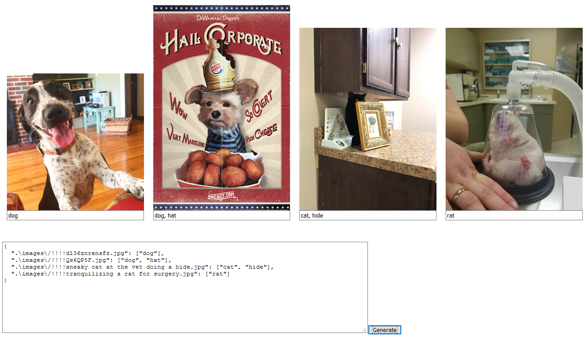

Imgtagger creates a basic static HTML + JS file for the manual tagging of images. Note that it doesn't do any pagination or 
image resizing so be careful before you start on your folder with gargantuan number of large images. 

Usage
---
    python tag.py /path/to/imgfolder
    
This will generate an `output.html` file. Separate the tags with a commas (`,`) e.g.

    dog cat  -> ["dog cat"]

    dog, cat -> ["dog", "cat"]
    
Write the tags and then simply tab to jump to the next image. It will auto scroll once at the bottom of the page.

Output
---
The image `dog.jpg` with the tags `dog` and `tail` will generate `"dog.jpg": ["dog", "tail"]`. This is intended to make it easy to look up tags based on the path or filename in another Python script by simply making it into a dict.

Preview
----

